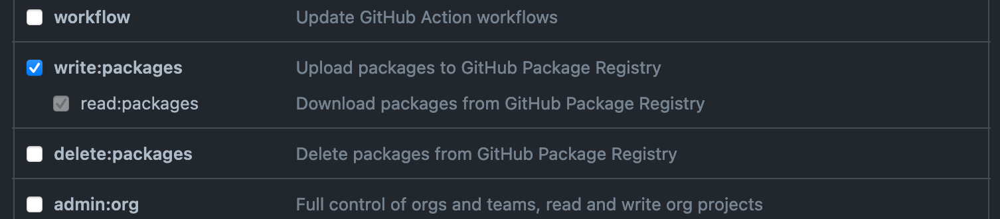

# Genesys' npm registry

### Running the development environment

> Make sure you have at least `write` access to this repository

Go to your GitHub account settings and generate a new personal access token for yourself. Follow the instructions @ https://docs.github.com/en/github/authenticating-to-github/keeping-your-account-and-data-secure/creating-a-personal-access-token

Set the `write:packages` scope as the following image shows.



Copy the generated token and add a new environment variable to your system like:

```sh
GITHUB_TOKEN=<your_token_here>
```

Check if you have npm version 7 or greater.

```sh
npm -v # 7.x.x
```

Update if you have anything lower than that.

```sh
npm i -g npm
```

Now open a new terminal window so the changes in your shell configuration are picked up, install the project dependencies and start the development environment.

```sh
git clone git@github.com:Genesyslife/npm-registry.git
cd npm-registry/
npm i && npm run develop
```

### Publishing a package to the registry

#### Publishing a package is a two step process

> Make sure you have no uncommitted changes in your working tree and then run the following commands from the project root folder.

```sh

```

1. Bump the package version according to the [semver](https://semver.org/) spec using the custom `release:version` script. You can pass any valid [npm-version](https://docs.npmjs.com/cli/v7/commands/npm-version) argument to it.

    ```sh
    npm --prefix=packages/video run release:version patch
    ```

2. Commit the changes automatically made to your package files, push them and publish the new package version using the custom `release:version` script.

    ```sh
    git commit -a -m "Bump package version" && git push
    npm --prefix=packages/video run release:publish
    ```


